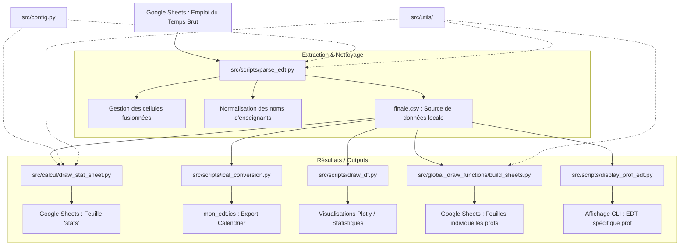

# Architecture du projet CNUM

Ce document contient le logigramme de l'architecture du projet, utilisant la syntaxe Mermaid.

```mermaid
graph TD
    %% Entrée de données
    GS_Raw[Google Sheets : Emploi du Temps Brut] --> Parse[src/scripts/parse_edt.py]
    
    %% Étape de Parsing
    subgraph "Extraction & Nettoyage"
        Parse --> Merges[Gestion des cellules fusionnées]
        Parse --> Norm[Normalisation des noms d'enseignants]
        Parse --> CSV[finale.csv : Source de données locale]
    end

    %% Flux de données vers les sorties
    CSV --> Stats[src/calcul/draw_stat_sheet.py]
    CSV --> ICal[src/scripts/ical_conversion.py]
    CSV --> Visu[src/scripts/draw_df.py]
    CSV --> TeacherSheets[src/global_draw_functions/build_sheets.py]
    CSV --> ProfEDT[src/scripts/display_prof_edt.py]

    %% Sorties
    subgraph "Résultats / Outputs"
        Stats --> GS_Stats[Google Sheets : Feuille 'stats']
        ICal --> ICS[mon_edt.ics : Export Calendrier]
        Visu --> Plots[Visualisations Plotly / Statistiques]
        TeacherSheets --> GS_Indiv[Google Sheets : Feuilles individuelles profs]
        ProfEDT --> CLI_Disp[Affichage CLI : EDT spécifique prof]
    end

    %% Configuration & Utilitaires
    Config[src/config.py] -.-> Parse
    Config -.-> Stats
    Utils[src/utils/] -.-> Parse
    Utils -.-> Stats
    Utils -.-> TeacherSheets
```
